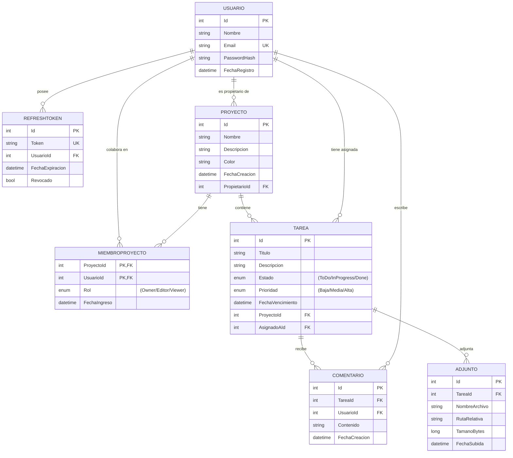

# Gestor de Tareas — API (backend)

API REST para la aplicación **Gestor de Proyectos y Tareas** (Capstone). Expone la lógica de negocio y los datos del
proyecto completo: autenticación JWT con refresh tokens, gestión de proyectos con roles (Owner/Editor/Viewer),
tareas tipo Kanban, comentarios, adjuntos y colaboración entre usuarios.

## Estado actual

- ✅ **Hito 1** — Modelo de datos (3FN), migraciones EF Core y autenticación (register / login / refresh / logout).
- ✅ **Hito 2** — CRUD de Proyectos y Tareas con autorización por ownership y rol + Swagger.
- ✅ **Hito 4** — Comentarios, adjuntos (máx. 5 MB, MIME validado) y gestión de miembros (invitar/remover/cambiar rol).
- ✅ **Extras** — `GET/PUT /auth/perfil` para la pantalla de perfil del SPA.
- ⬜ **Hito 5** — Despliegue en la nube (pendiente).

## Tecnologías

- .NET 8 (ASP.NET Core Web API)
- Entity Framework Core (Code First + migraciones) — SQL Server LocalDB en dev
- JWT Bearer + refresh tokens con rotación y revocación (almacenados en BD)
- Swashbuckle (Swagger con botón **Authorize**)
- `JsonStringEnumConverter`: los enums se serializan como strings (`"ToDo"`, `"Owner"`, `"Media"`)
- Error handling global con `ProblemDetails` (RFC 7807): las excepciones de dominio se mapean a 404/403/409/401 y el 500 nunca filtra stack traces
- Logging estructurado con `ILogger<T>` en todos los servicios
- Health check en `/health`

## Endpoints (`/api/v1`)

| Método | Ruta | Descripción | Acceso |
|---|---|---|---|
| POST | `/auth/register` | Crear cuenta | Público |
| POST | `/auth/login` | Login → access + refresh token | Público |
| POST | `/auth/refresh` | Renovar access token | Público |
| POST | `/auth/logout` | Invalidar refresh token | Público |
| GET | `/auth/perfil` | Ver perfil propio | Autenticado |
| PUT | `/auth/perfil` | Editar nombre/email | Autenticado |
| GET | `/proyectos` | Listar proyectos del usuario (propios y compartidos) | Autenticado |
| GET | `/proyectos/{id}` | Detalle (si el usuario tiene acceso) | Autenticado |
| POST | `/proyectos` | Crear (creador = Owner) | Autenticado |
| PUT | `/proyectos/{id}` | Modificar (Owner/Editor) | Autenticado |
| DELETE | `/proyectos/{id}` | Eliminar (solo Owner; falla si tiene tareas) | Autenticado |
| GET | `/proyectos/{id}/miembros` | Listar miembros | Autenticado |
| POST | `/proyectos/{id}/miembros` | Invitar por email | Owner |
| PUT | `/proyectos/{id}/miembros/{userId}/rol` | Cambiar rol | Owner |
| DELETE | `/proyectos/{id}/miembros/{userId}` | Remover miembro | Owner |
| GET | `/proyectos/{id}/tareas?estado=&prioridad=&asignadoAId=&page=&pageSize=` | Listar tareas paginado + filtros | Autenticado |
| POST | `/proyectos/{id}/tareas` | Crear tarea | Owner/Editor |
| GET | `/tareas/{id}` | Detalle (incluye comentarios y adjuntos) | Autenticado |
| PUT | `/tareas/{id}` | Modificar | Owner/Editor |
| PATCH | `/tareas/{id}/estado` | Cambiar estado (drag-and-drop Kanban) | Owner/Editor |
| DELETE | `/tareas/{id}` | Eliminar | Owner/Editor |
| POST | `/tareas/{id}/comentarios` | Agregar comentario | Autenticado |
| DELETE | `/comentarios/{id}` | Eliminar (solo autor) | Autor |
| POST | `/tareas/{id}/adjuntos` | Subir adjunto (multipart) | Owner/Editor |
| GET | `/adjuntos/{id}` | Descargar | Autenticado |
| DELETE | `/adjuntos/{id}` | Eliminar | Owner/Editor |
| GET | `/health` | Health check | Público |

## Usuarios de prueba (seed)

| Email | Password | Rol |
|---|---|---|
| joel@demo.com | Demo1234! | Owner del proyecto "Proyecto Capstone" |
| ana@demo.com | Demo1234! | Miembro (Editor) del proyecto "Proyecto Capstone" |

## Cómo ejecutarlo localmente

1. Requiere .NET SDK 8+ y SQL Server LocalDB (con Visual Studio viene incluido).
2. Abrir una terminal en `Backend/gestor-tareas-api`:
   ```
   dotnet restore
   dotnet ef database update
   dotnet run
   ```
   > En Development, `Program.cs` ejecuta `Migrate()` + seed automáticamente al arrancar.
3. Abrir Swagger en `https://localhost:52411/swagger` (revisa el puerto en `Properties/launchSettings.json`).
4. Configuración por variables de entorno:
   - `ConnectionStrings__DefaultConnection` — conexión a SQL Server / PostgreSQL.
   - `Jwt__Secret` — secreto de mínimo 32 caracteres (¡nunca en el repo en producción!).
   - `SpaOrigin` — origen permitido por CORS (default `http://localhost:5173`).
   - `UploadsPath` — carpeta local de adjuntos (default `Uploads`).

## Reglas de negocio

- Un usuario solo ve/edita proyectos donde es propietario o miembro.
- `Owner`: permisos totales (incl. miembros y eliminar proyecto).
- `Editor`: crea/modifica/elimina tareas, no gestiona miembros.
- `Viewer`: solo lectura.
- Un comentario lo elimina únicamente su autor.
- No se puede eliminar un proyecto que tenga tareas asociadas.
- Adjuntos: máximo 5 MB y MIME válido (imágenes y PDF).
- Contraseñas guardadas únicamente como hash (`PasswordHasher` de ASP.NET Core Identity).

## Diagrama Entidad-Relación



## Estructura

```
Controllers/      Auth, Proyectos, Tareas, Comentarios, Adjuntos
Services/         Lógica de negocio (interfaces + implementaciones) + excepciones de dominio
Models/           Entidades EF Core (Usuarios, Proyectos, Tareas, Comentarios, Adjuntos, RefreshTokens)
DTOs/             DTOs de entrada/salida (nunca se exponen entidades EF)
Data/             DbContext (Fluent API) + SeedData
Middleware/       ExceptionMiddleware → ProblemDetails
Migrations/       Migraciones versionadas de EF Core
Extensions/       ClaimsPrincipalExtensions (obtener id de usuario del token)
```